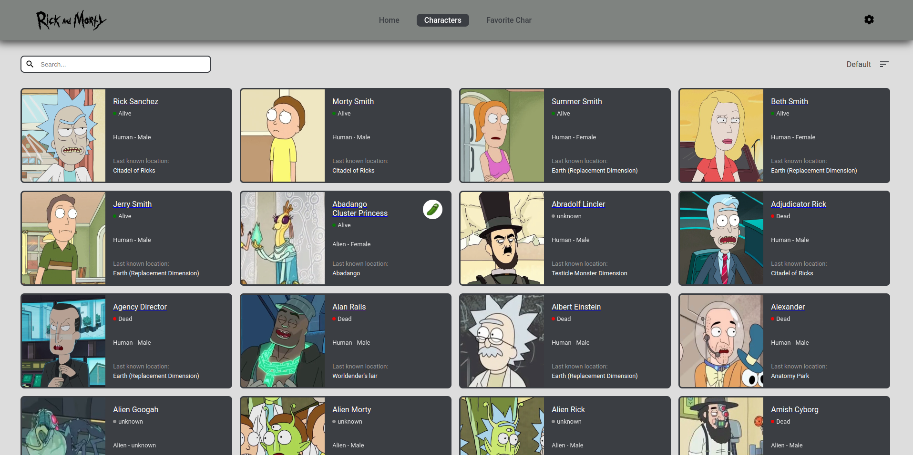

# Rick and Morty  App



This simple React application fetches character data from the Rick and Morty API and displays them with sorting functionalities.

## Installation
## Local Setup

 Clone this repository.


```bash
git clone git@github.com:byron00123/Rick-and-Morty-App.git
npm install 
```
## Functionalities
* **Character Listing:** View a list of characters with their names and images.
* **Sorting:** Organize the character list alphabetically (A-Z and Z-A) using the sorting functionality.
* **Filtering:** Filter Characters (alive,dead or unknown)
* **Search:** Search  charaters by name.
* **AddFavoriteCharacter:** Add favorite characters
* **Responsive WebDesign

